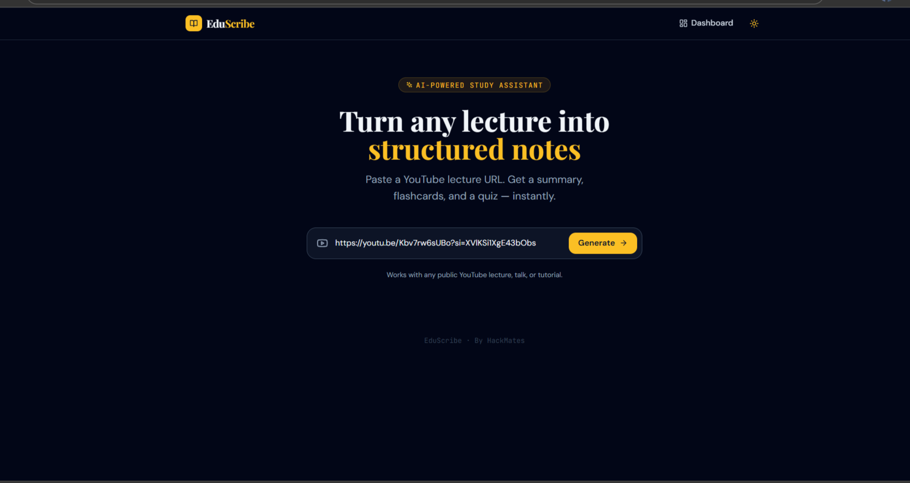
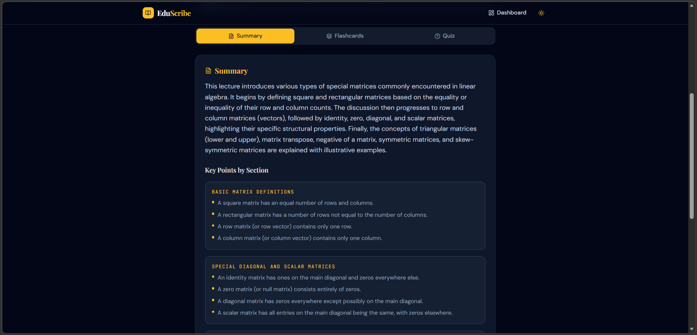
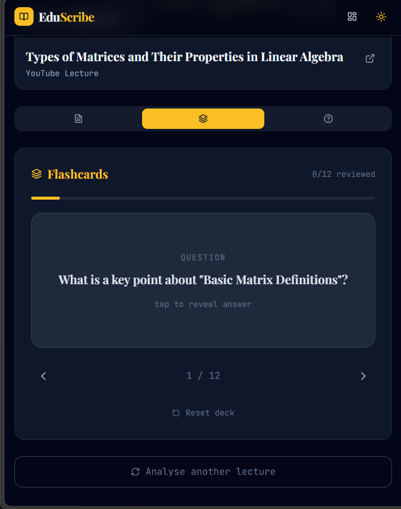
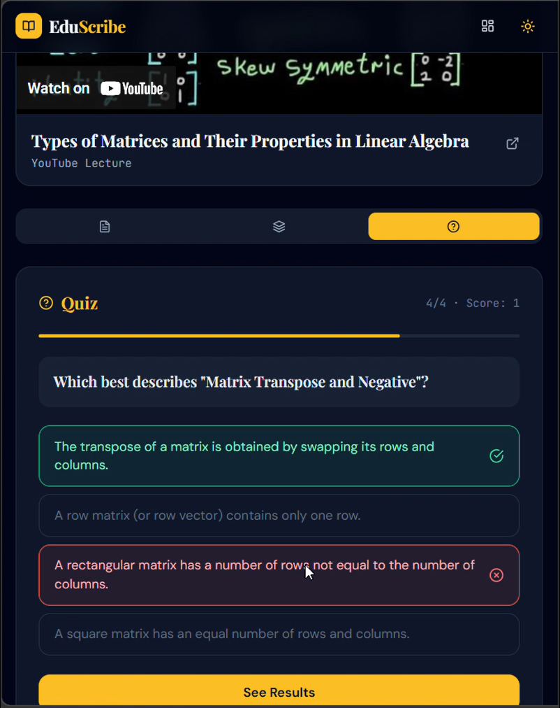

# 🧠 EduScribe AI

**Turn any YouTube lecture into a complete study pack — in seconds.**

---

## Overview

EduScribe AI is an AI-powered learning assistant built for students who rely on YouTube to learn. Paste any lecture URL and EduScribe instantly extracts the transcript, processes it with Google Gemini, and delivers a structured summary, organised notes, flashcards, a quiz, and key terms — all in one place.

No more rewatching. No more scattered notes. Just focused, efficient learning.

---

## Key Features

- 📝 **AI Summaries** — Full lecture distilled into a clear academic paragraph
- 📋 **Structured Notes** — Section-wise bullet points organised by topic
- 🃏 **Flashcards** — Flip-card revision with progress tracking
- ❓ **Auto Quiz** — Multiple-choice questions with instant scoring
- 🏷️ **Keyword Extraction** — Key concepts highlighted for fast review
- 📺 **Video Preview** — Embedded player alongside your notes
- 🌙 **Dark Mode** — Easy on the eyes during late-night study sessions
- 📊 **Study Dashboard** — Track videos studied, flashcards reviewed, and quiz accuracy

---

## Screenshots

### Homepage

> *Clean URL input screen — paste your YouTube lecture link and hit Generate.*

### Summary Output

> *AI-generated summary with structured notes organised by topic.*

### Flashcards

> *Flip-card revision mode with progress indicator.*

### Quiz

> *Auto-generated multiple choice quiz with instant answer feedback.*

---

## Tech Stack

**Frontend**
- React + JSX, Vite, TailwindCSS, JavaScript ES6+

**Backend**
- Python 3.10+, FastAPI, Uvicorn, Pydantic v2

**AI**
- Google Gemini 2.0 Flash (via `google-generativeai`)

**APIs & Utilities**
- `youtube-transcript-api` — transcript extraction
- `python-dotenv` — environment variable management

---

## Installation & Setup

### 1. Clone the repository

```bash
git clone https://github.com/your-username/eduscribe-ai.git
cd eduscribe-ai
```

### 2. Backend

```bash
cd Backend

# Create and activate virtual environment
python -m venv venv
source venv/bin/activate        # Windows: venv\Scripts\activate

# Install dependencies
pip install -r requirements.txt

# Set up environment variables
cp .env.example .env
# Open .env and add your GEMINI_API_KEY

# Start the server
uvicorn app.main:app --reload --port 8000
```

API live at → `http://localhost:8000`
Interactive docs → `http://localhost:8000/docs`

### 3. Frontend

```bash
cd frontend
npm install
npm run dev
```

App live at → `http://localhost:5173`

> The Vite dev server automatically proxies API requests to the backend — no CORS setup needed.

---

## Usage

1. Open the app at `http://localhost:5173`
2. Paste any YouTube lecture URL into the input field
3. Click **Generate Study Pack**
4. Navigate between tabs: **Summary · Notes · Flashcards · Quiz · Keywords**
5. Use the **Dashboard** to track your study progress over time

**Supported URL formats:**
```
https://www.youtube.com/watch?v=VIDEO_ID
https://youtu.be/VIDEO_ID
https://www.youtube.com/shorts/VIDEO_ID
```

---

## Project Structure

```
eduscribe-ai/
├── Backend/
│   ├── app/main.py              # FastAPI entry point
│   ├── routes/summarize.py      # POST /process-video endpoint
│   ├── services/
│   │   ├── ai_service.py        # Gemini AI integration
│   │   └── youtube_service.py   # Transcript extraction
│   ├── models/                  # Pydantic request & response models
│   └── requirements.txt
│
└── frontend/
    └── src/
        ├── App.jsx              # Root component & state
        ├── components/          # Navbar, Flashcards, Quiz, Dashboard ...
        ├── pages/               # ResultsPage
        └── services/            # API calls, study utils, dashboard hook
```

---

## Future Improvements

- **PDF Export** — Download your full study pack as a formatted PDF
- **Playlist Mode** — Process an entire YouTube playlist in one click
- **Spaced Repetition** — Smart flashcard scheduling based on recall performance
- **Multi-language Support** — Generate notes in the student's preferred language

---


**Ahinsa Mohanty** — [GitHub](https://github.com/ahinsa2) · [LinkedIn](www.linkedin.com/in/ahinsa-mohanty-290765331)
**Souhardya Banerjee** — [GitHub](https://github.com/souhardya777) · [LinkedIn](https://www.linkedin.com/in/souhardya-banerjee-358216334)

---

> *EduScribe AI — Because Lectures should teach, not just play*